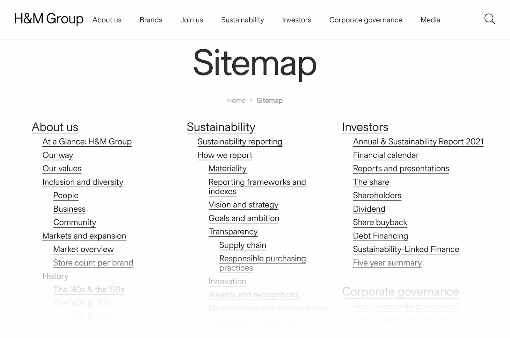

# ✅ Navigation methods

Wcag criterion: [📜 2.4.5 Multiple Ways - AA](..)

## Description

There are at least two of the following three methods for accessing content: Navigation, search function, sitemap.

## Method

**Manual check:** Look through the website and check whether a search function or sitemap exists.

## Details on web applicability (specific test steps)

🇩🇪 Currently only available in German.

## Details on mobile applicability (additions to web)

🇩🇪 Currently only available in German.

## Details on PDF applicability (additions to web)

🇩🇪 Currently only available in German.

## Blind testable details

🇩🇪 Currently only available in German.

## Screenshots

## Videos

🇩🇪 Currently only available in German.
