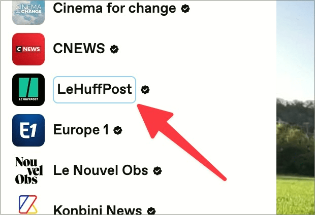

# ✅ Keyboard-Focus visible

Wcag criterion: [📜 2.4.7 Focus Visible - AA](..)

## Description

The keyboard focus is sufficiently visible, e.g. through a clearly visible frame (for all focusable elements such as links, buttons, radio buttons, checkboxes, drop-down lists, linked graphic elements, etc.).

## Method

**Keyboard:** Navigate through elements using the Tab key and ensure that the focus is visible.

## Details on web applicability (specific test steps)

🇩🇪 Currently only available in German.

## Screenshots

### Clearly visible focus

### Poorly visible focus

## Videos

- [🎬 Interaktive Elemente ohne sichtbaren Fokus (Focus-Reset) - Watson](/videos/interaktive-elemente-ohne-sichtbaren-fokus-focus-reset-watson)