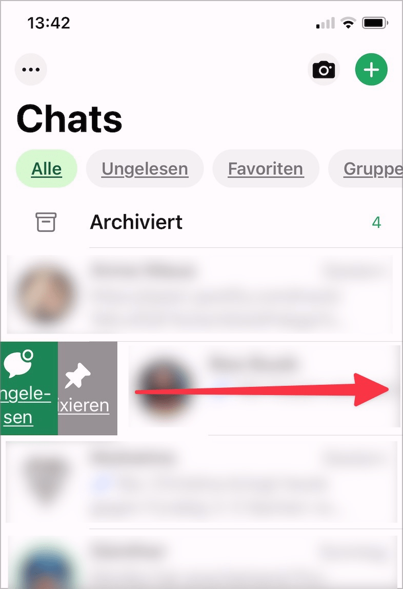

# ✅ Alternative for path and multi-point pointer gestures

Wcag criterion: [📜 2.5.1 Pointer Gestures - A](..)

## Description

Alternatives exist for path-based or multi-point pointer gestures that can be operated with simple pointer gestures (such as click, double-click or click-and-hold).

## Method

**Manual check:** Review elements, interact with them and ensure that equivalent alternative input methods are available.

## Details on web applicability (specific test steps)

🇩🇪 Currently only available in German.

## Details on mobile applicability (additions to web)

🇩🇪 Currently only available in German.

## Details on PDF applicability (additions to web)

🇩🇪 Currently only available in German.

## Blind testable details

🇩🇪 Currently only available in German.

## Screenshots

## Videos

No videos available.
