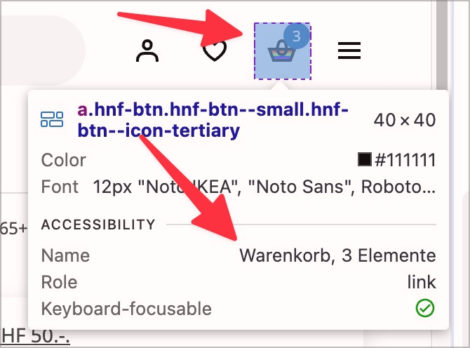

# ✅ Accessible labelling

Wcag criterion: [📜 2.5.3 Label in Name - A](..)

## Description

The accessible labelling of a control element corresponds exactly to the visual labelling or includes it (enables voice control in particular).

## Method

**Screen reader:** Navigate through operating elements using the tab key and check whether the output corresponds to the visual labelling.

## Details on web applicability (specific test steps)

🇩🇪 Currently only available in German.

## Screenshots

