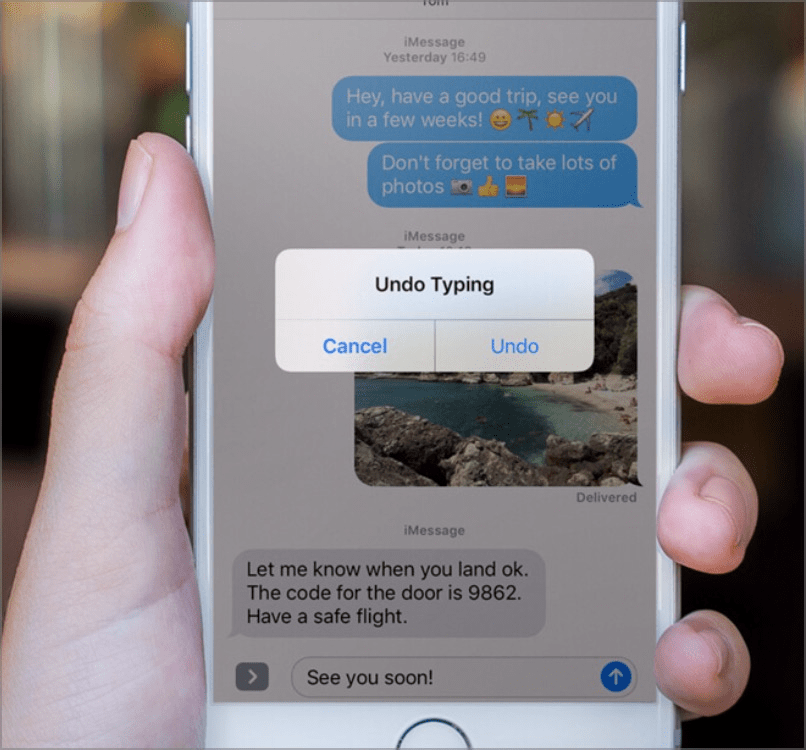
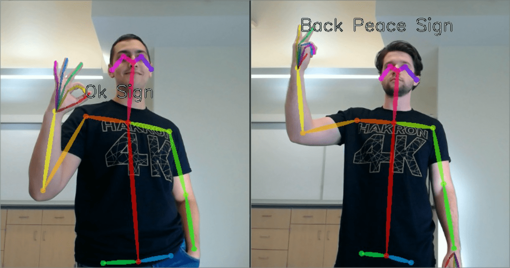

# ✅ Alternatives for movement activation

## Description

Functionality executed by motion activation (e.g. device movement or recognition of gestures via video) can also be activated and deactivated using conventional input methods.

## Method

**Manual testing:** Review elements, interact with them and ensure that they can be interacted with in the same way using conventional input methods.

## Details on web applicability (specific test steps)

🇩🇪 Currently only available in German.

## Screenshots

