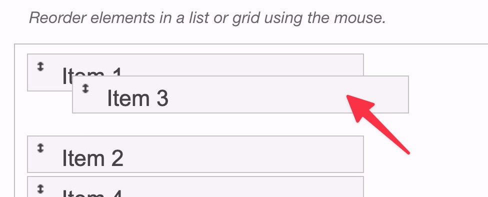
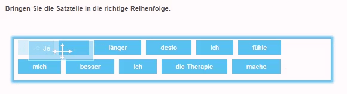
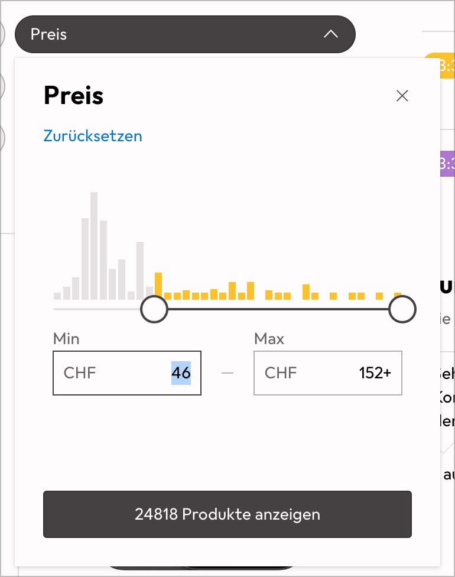
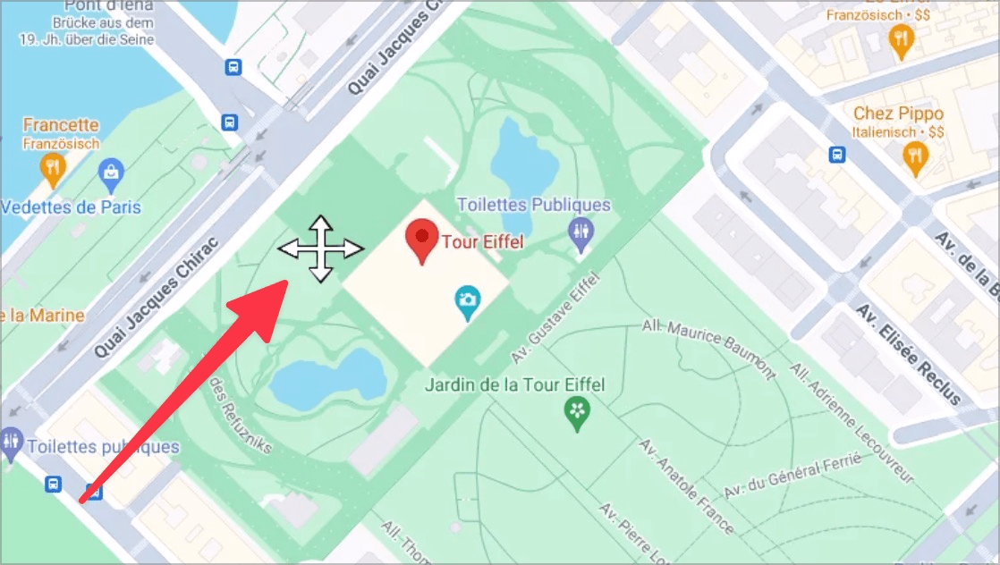
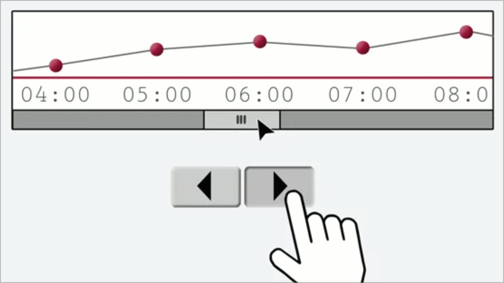

# ✅ Alternative to pulling movements

## Description

There are alternatives for drag & drop movements that can be operated with simple pointer gestures (such as clicking, double-clicking or click-and-hold).

## Method

**Keyboard:** Make sure that drag movements can also be operated with simple pointer gestures (e.g. click, double-click, or click-and-hold).

## Details on web applicability (specific test steps)

🇩🇪 Currently only available in German.

## Screenshots

