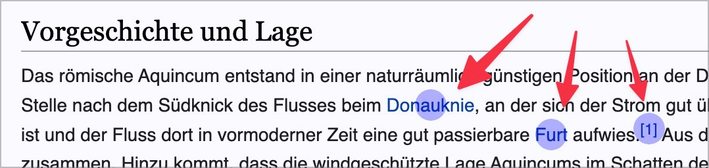
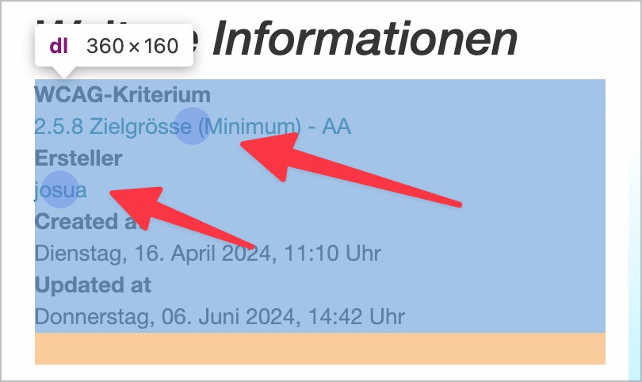
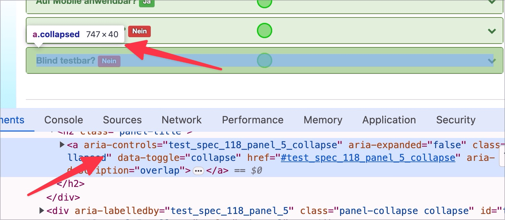
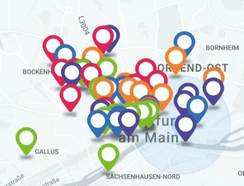
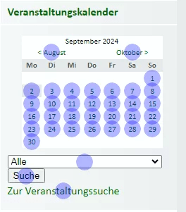

# ✅ Target size and distance

Wcag criterion: [📜 2.5.8 Target Size (Minimum) - AA](..)

## Description

Activatable elements have the required minimum size or sufficient spacing.

## Method

**Bookmarklet ‘Target-Size ’**: Execute and compare with page: Are there elements that are too small and have too little spacing?

## Details on web applicability (specific test steps)

🇩🇪 Currently only available in German.

## Details on mobile applicability (additions to web)

🇩🇪 Currently only available in German.

## Details on PDF applicability (additions to web)

🇩🇪 Currently only available in German.

## Blind testable details

🇩🇪 Currently only available in German.

## Screenshots

## Videos

No videos available.
