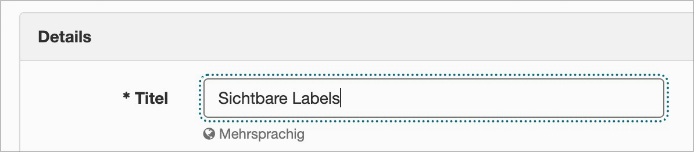
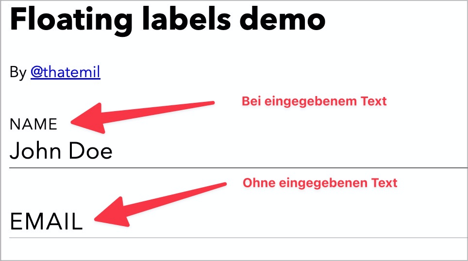

# Checkpoint: Visible labels

## Description

Form fields have visually visible labels. The sole use of `placeholder` attributes for labeling form fields is avoided.

## Method

**Keyboard:** Navigate through input fields using the Tab key and make sure that they always have a label and that this remains visible even when the focus is set.

## Details on web applicability (specific test steps)

🇩🇪 Currently only available in German.

## Screenshots

