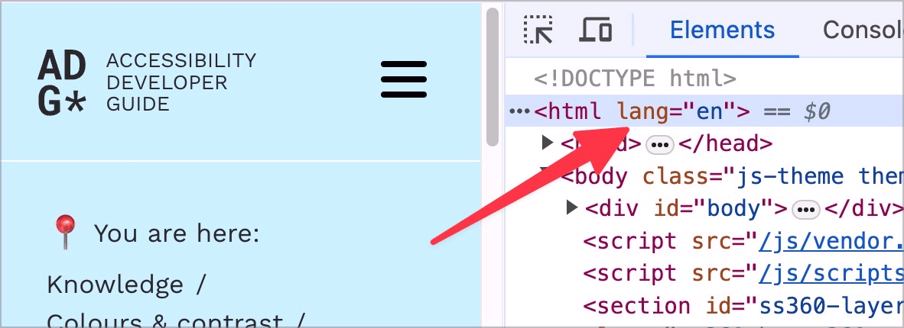
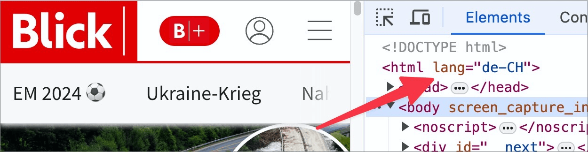
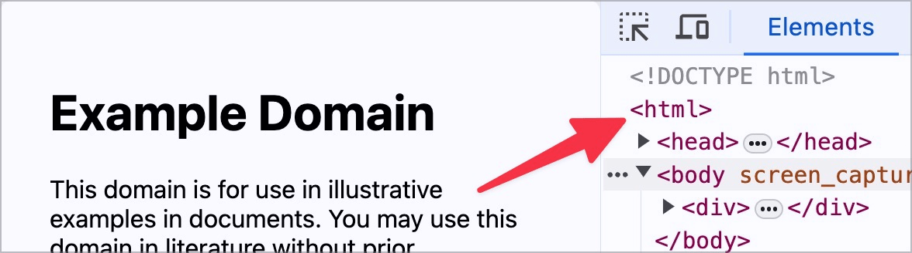

# ✅ Declaration of language

Wcag criterion: [📜 3.1.1 Language of Page - A](..)

## Description

The language declaration is available and correct.

## Method

**Manual check:** Check pages and make sure that they have the correct `lang`- attribute set in the `<html>` tag.

## Details on web applicability (specific test steps)

🇩🇪 Currently only available in German.

## Screenshots

