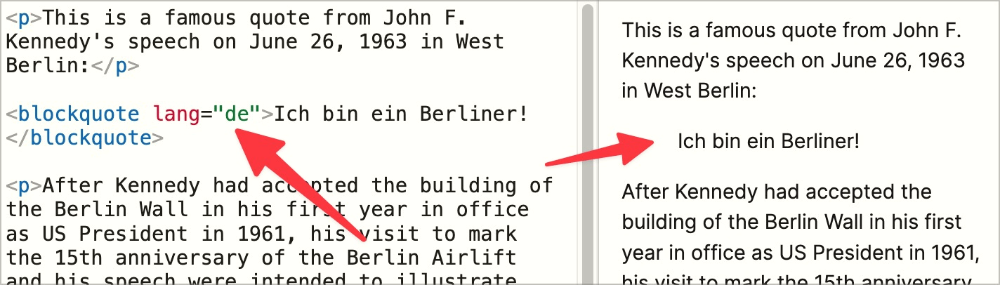
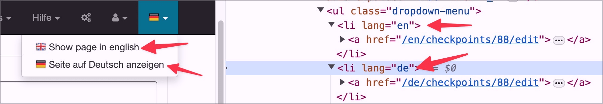

# ✅ Language change

Wcag criterion: [📜 3.1.2 Language of Parts - AA](..)

## Description

Language changes for longer text passages are indicated: Text passages in other languages are labelled with the ‘lang’-attribute. In the case of short passages of text in other languages (individual words), the language change is omitted.

## Method

**Manual check:** Look through pages and make sure that content with a language change has the correct ‘lang’- attribute set.

## Details on web applicability (specific test steps)

🇩🇪 Currently only available in German.

## Screenshots

