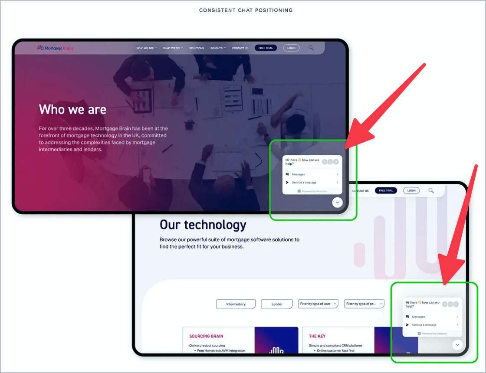

# ✅ Consistent help

Wcag criterion: [📜 3.2.6 Consistent Help - A](..)

## Description

Assistance is offered consistently across processes and sub-pages.

## Method

**Manual check:** Review processes and sub-pages and assess the positioning of the help functions.

## Details on web applicability (specific test steps)

🇩🇪 Currently only available in German.

## Details on mobile applicability (additions to web)

🇩🇪 Currently only available in German.

## Details on PDF applicability (additions to web)

🇩🇪 Currently only available in German.

## Blind testable details

🇩🇪 Currently only available in German.

## Screenshots

## Videos

No videos available.
