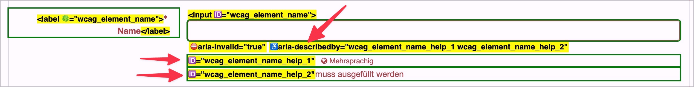

# Checkpoint: Error messages in forms

## Description

Error messages in forms are implemented barrier-free: Automatically recognized input errors provide a clear indication (in text form) of the incorrect element in the error message and are clearly linked to it.

## Method

Interact with the form and check whether error messages are displayed as expected.

## Details on web applicability (specific test steps)

🇩🇪 Currently only available in German.

## Screenshots

