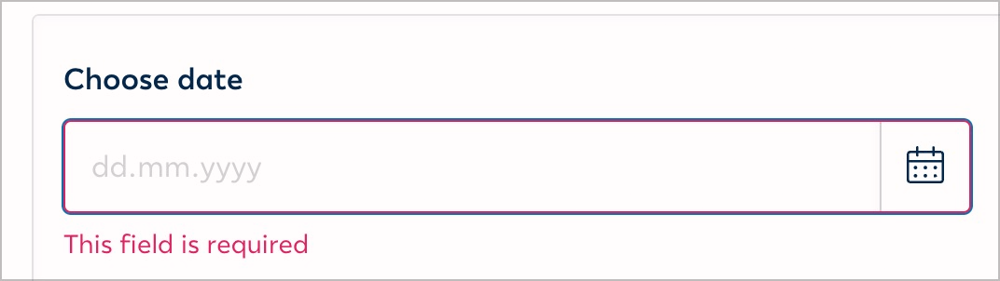
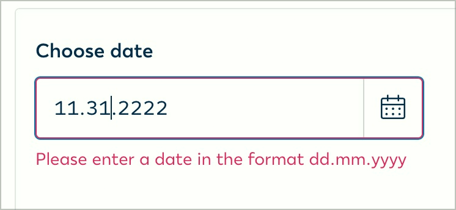

# ✅ Format information

## Description

Format information for form fields is accessible and clearly linked to the associated input fields, i.e. additional information on input formats can also be correctly entered using assistive technologies.

## Method

**Screen reader:** Navigate through mandatory fields using the tab key and check whether format information and additional notes are displayed.

## Details on web applicability (specific test steps)

🇩🇪 Currently only available in German.

## Screenshots

