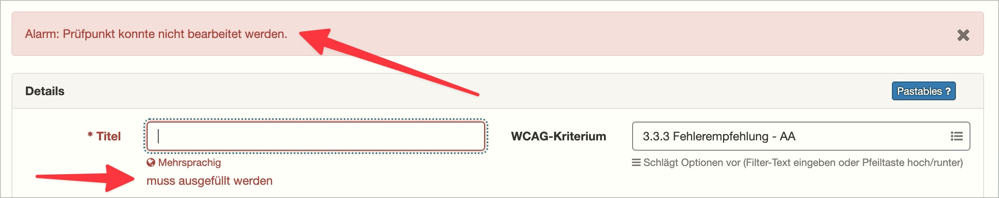
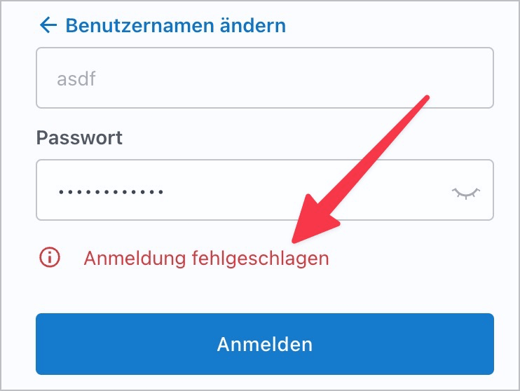
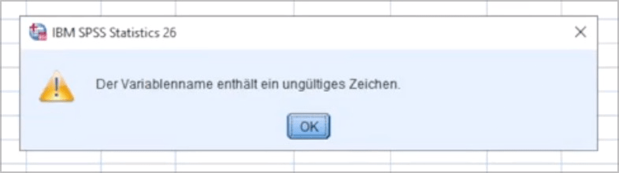

# ✅ Informative error messages

Wcag criterion: [📜 3.3.3 Error Suggestion - AA](..)

## Description

Error messages are informative and clearly linked to the associated input fields: Correction recommendations are available if incorrect user entries are made.

## Method

**Manual check:** Review error messages and assess information content.

## Details on web applicability (specific test steps)

🇩🇪 Currently only available in German.

## Details on mobile applicability (additions to web)

🇩🇪 Currently only available in German.

## Details on PDF applicability (additions to web)

🇩🇪 Currently only available in German.

## Blind testable details

🇩🇪 Currently only available in German.

## Screenshots

## Videos

🇩🇪 Currently only available in German.
