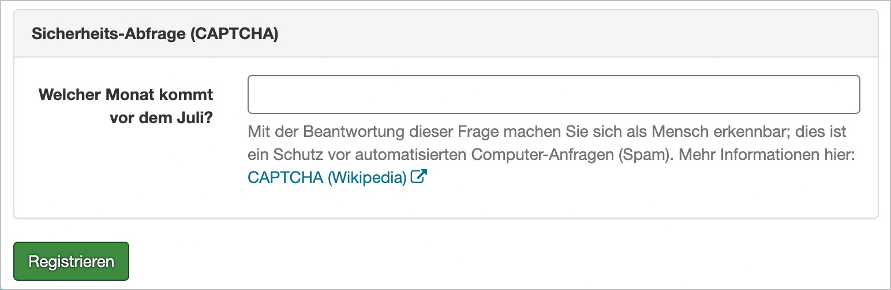
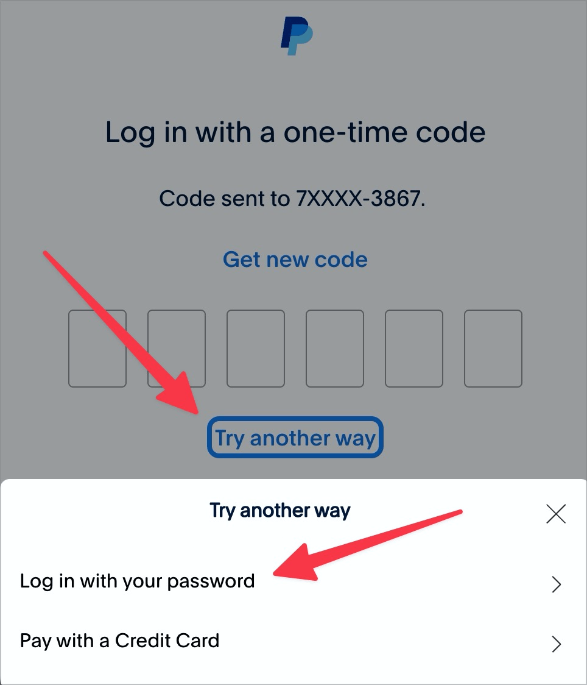

# ✅ Accessible authentication

Wcag criterion: [📜 3.3.8 Accessible Authentication (Minimum) - AA](..)

## Description

At least one of the authentication options provided is accessible to different user groups. In particular, copy and paste is not prevented.

## Method

**Manual review:** Review the authentication options offered to different user groups.

## Details on web applicability (specific test steps)

🇩🇪 Currently only available in German.

## Details on mobile applicability (additions to web)

🇩🇪 Currently only available in German.

## Details on PDF applicability (additions to web)

🇩🇪 Currently only available in German.

## Blind testable details

🇩🇪 Currently only available in German.

## Screenshots

## Videos

No videos available.
