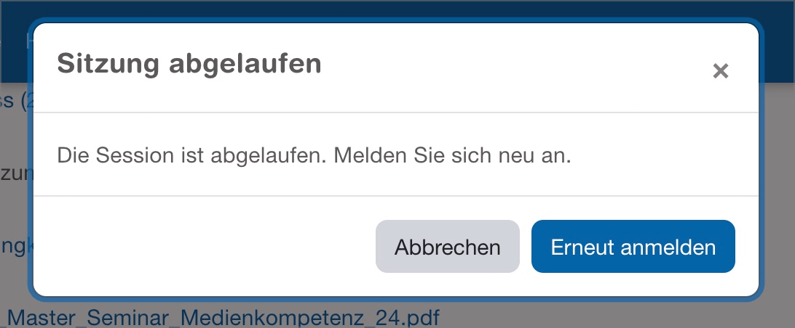

# Checkpoint: Dialogs

## Description

Dialogs (also called modals, overlays, lightboxes, etc.) are implemented barrier-free. They are correctly announced by screen readers.

## Method

**Screenreader:** Interact with dialogs and make sure they behave as expected.

## Details on web applicability (specific test steps)

🇩🇪 Currently only available in German.

## Screenshots

