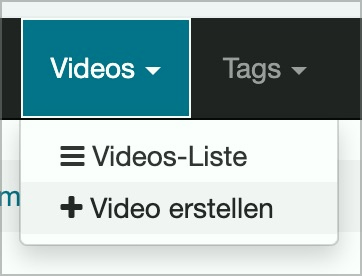
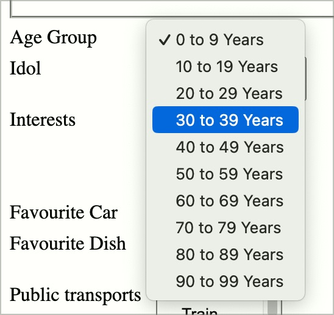
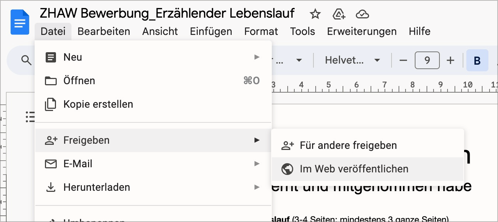

# Checkpoint: Disclosure (pop-up elements)

## Description

Discolsure (also mega disclosure) are implemented barrier-free. They are correctly announced by screen readers, their status is communicated (e.g. "expanded" or ‘"reduced"), the current entry when navigating the options is communicated by screen readers.

## Method

**Screenreader:** Interact with disclosure and make sure they behave as expected.

## Details on web applicability (specific test steps)

🇩🇪 Currently only available in German.

## Screenshots

