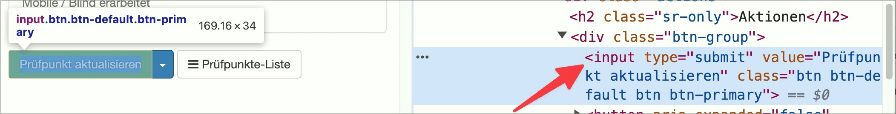
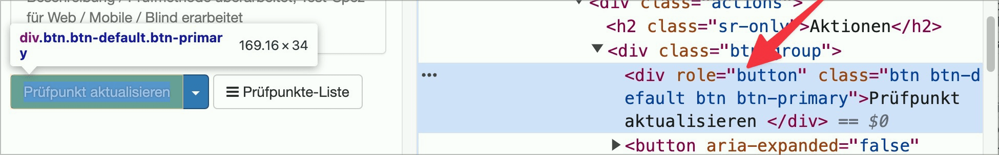

# ✅ Form switch implemented correctly

Wcag criterion: [📜 4.1.2 Name, Role, Value - A](..)

## Description

Form buttons are implemented correctly (as a `<button>` element or `<input type=‘submit’>` element).

## Method

List form elements and check whether switches have been implemented correctly.

## Details on web applicability (specific test steps)

🇩🇪 Currently only available in German.

## Details on mobile applicability (additions to web)

🇩🇪 Currently only available in German.

## Details on PDF applicability (additions to web)

🇩🇪 Currently only available in German.

## Blind testable details

🇩🇪 Currently only available in German.

## Screenshots

## Videos

No videos available.
