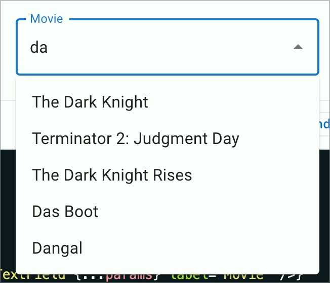
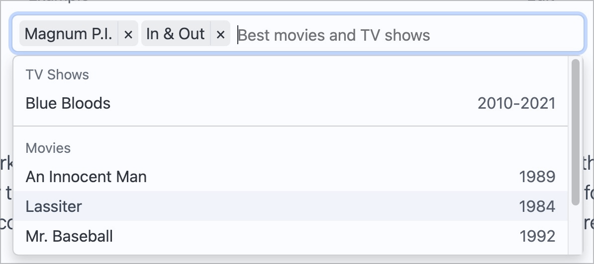

# ✅ Autocompletes (comboboxes)

Wcag criterion: [📜 4.1.2a Advanced controls (widgets)](..)

## Description

Autocompletes are implemented barrier-free. They are correctly announced by screen readers, the number of currently available suggestions, the current entry when navigating the options and the finally selected option are conveyed by screen readers.

## Method

**Screenreader:** Interact with Autocompletes and make sure they behave as expected.

## Details on web applicability (specific test steps)

🇩🇪 Currently only available in German.

## Screenshots

