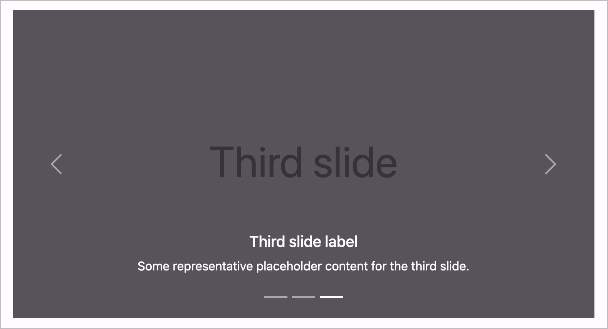

# Checkpoint: Carousels

## Description

Carousels (sliders) are implemented barrier-free. They are correctly announced by screen readers.

## Method

**Screenreader:** Interact with carousels and make sure they behave as expected.

## Details on web applicability (specific test steps)

🇩🇪 Currently only available in German.

## Screenshots

