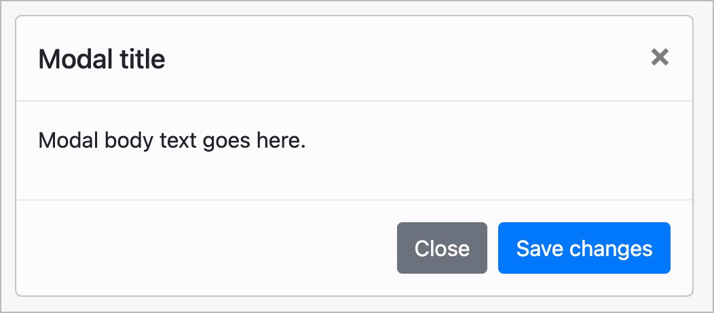

# ✅ Dialogs

Wcag criterion: [📜 4.1.2a Advanced controls (widgets)](..)

## Description

Dialogs (also called modals, overlays, lightboxes, etc.) are implemented barrier-free. They are correctly announced by screen readers.

## Method

**Screenreader:** Interact with dialogs and make sure they behave as expected.

## Details on web applicability (specific test steps)

🇩🇪 Currently only available in German.

## Details on mobile applicability (additions to web)

🇩🇪 Currently only available in German.

## Details on PDF applicability (additions to web)

🇩🇪 Currently only available in German.

## Blind testable details

🇩🇪 Currently only available in German.

## Screenshots

## Videos

No videos available.
