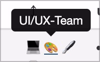
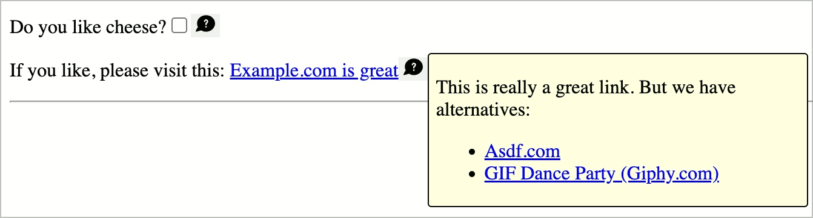

# Checkpoint: QuickInfos / Toggletips

## Description

Tooltips are implemented barrier-free. Simple, short content is immediately announced by screen readers. If tooltips contain complex content, it must be possible to read them manually (in this case it is more of a dialog).

## Method

**Screenreader:** Interact with tooltips and make sure they behave as expected **Keyboard:** Repeat the above procedure.

## Details on web applicability (specific test steps)

🇩🇪 Currently only available in German.

## Screenshots

