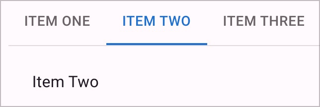
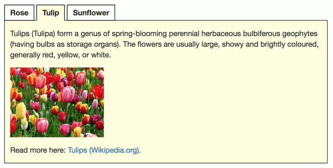
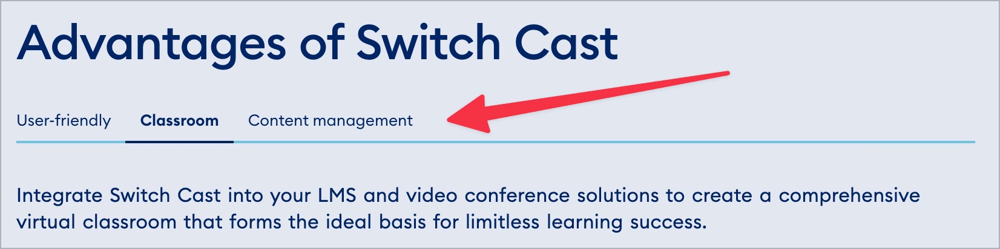

# ✅ Tabs / tablists

Wcag criterion: [📜 4.1.2a Advanced controls (widgets)](..)

## Description

Tabs are implemented barrier-free. They are correctly announced by screen readers and their status is communicated (e.g. "active" or "not active").

## Method

**Screenreader:** Interact with tabs and make sure they behave as expected.

## Details on web applicability (specific test steps)

🇩🇪 Currently only available in German.

## Screenshots

