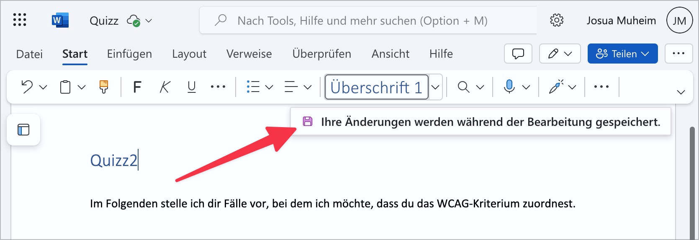
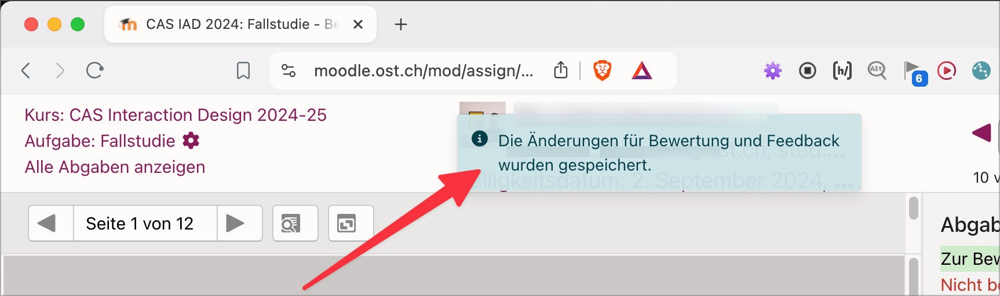

# ✅ Status messages

Wcag criterion: [📜 4.1.3 Status Messages - AA](..)

## Description

Status messages are accessible to assistive technologies and do not overload the audio channel.

## Method

**Screenreader:** Ensure that status messages behave as expected.

## Details on web applicability (specific test steps)

🇩🇪 Currently only available in German.

## Details on mobile applicability (additions to web)

🇩🇪 Currently only available in German.

## Details on PDF applicability (additions to web)

🇩🇪 Currently only available in German.

## Blind testable details

🇩🇪 Currently only available in German.

## Screenshots

## Videos

🇩🇪 Currently only available in German.
